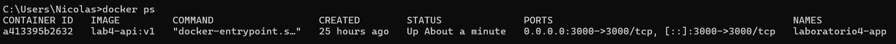
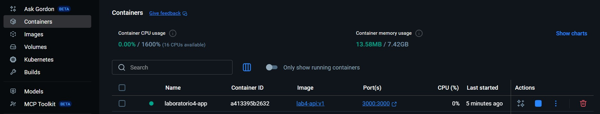
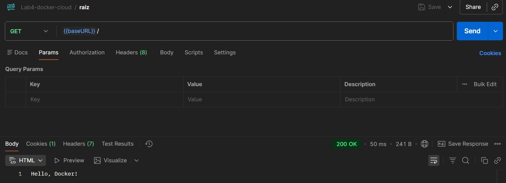
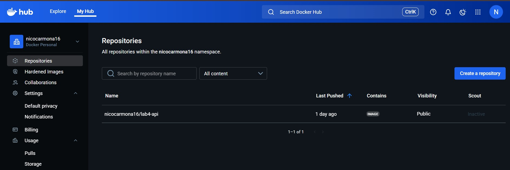

# Lab4-docker

## Contenedor corriendo
Contenedor activo verificado mediante el comando `docker ps` en la terminal.

## Docker Desktop
Contenedor ejecutándose y visible en la interfaz de Docker Desktop.

## Prueba de endpoint
Prueba exitosa del endpoint raíz (`/`) desde Postman.

## Imagen en Docker Hub
Imagen publicada y disponible en el repositorio de Docker Hub.

